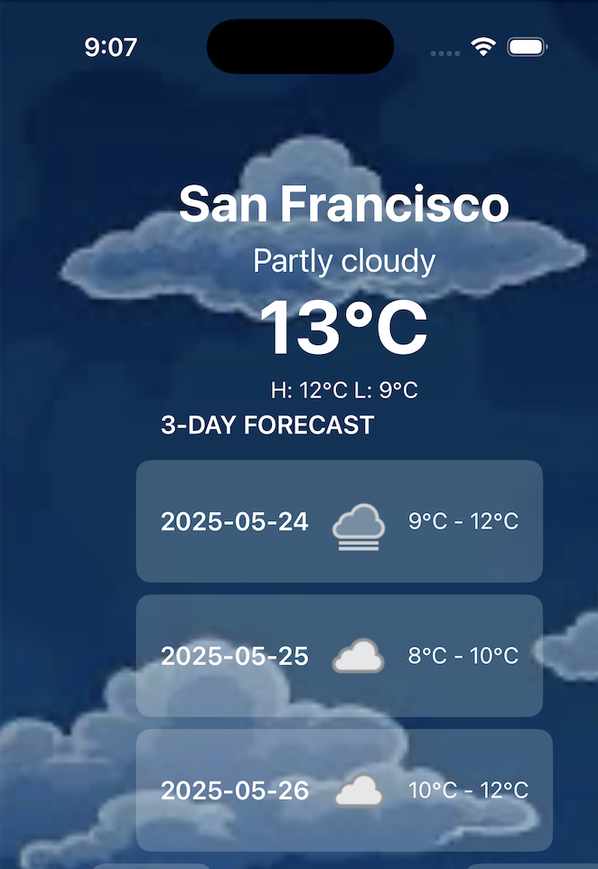
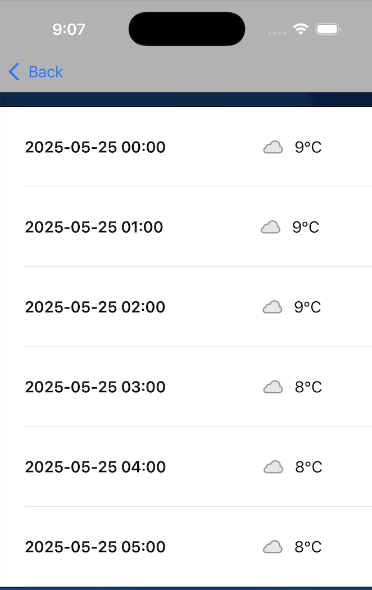

# WeatherCast App ☀️🌧️

A SwiftUI-based iOS weather app that provides real-time weather updates and a 3-day forecast with a dynamic, time-adaptive user interface.

## 📱 Features
- Real-time weather updates
- 3-day weather forecast
- UI dynamically changes based on the time of day
- Humidity, visibility, and pressure indicators
- Clean and modern SwiftUI design

## 🛠️ Tech Stack
- **Language:** Swift
- **Framework:** SwiftUI
- **Architecture:** MVC

## 📸 Screenshots

| Screenshot 1 | Screenshot 2 |
|--------------|--------------|
|  |  |

